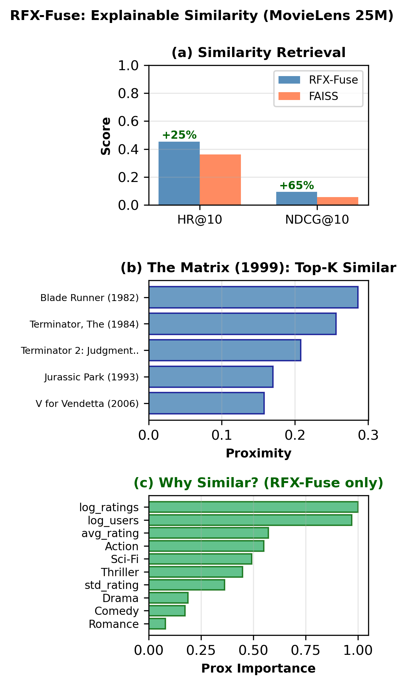
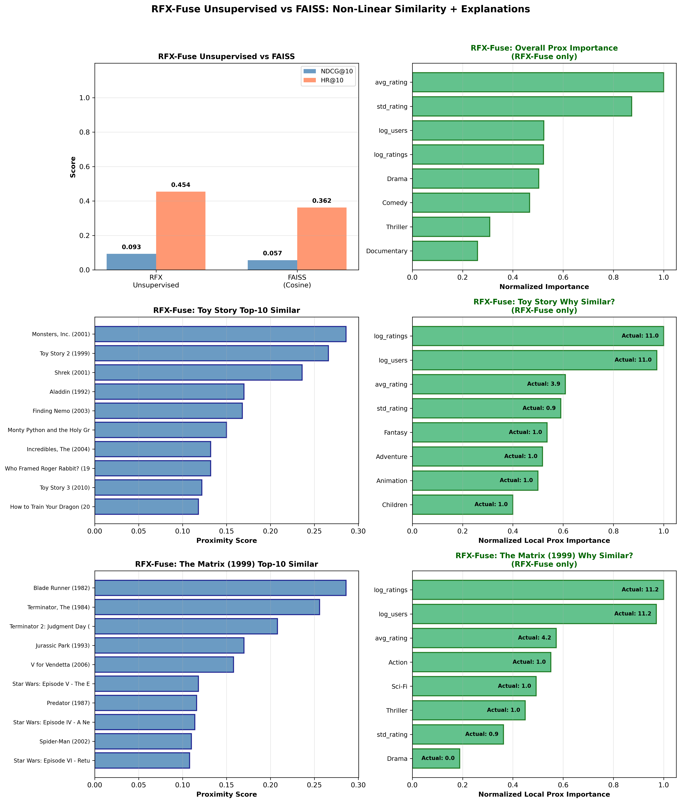
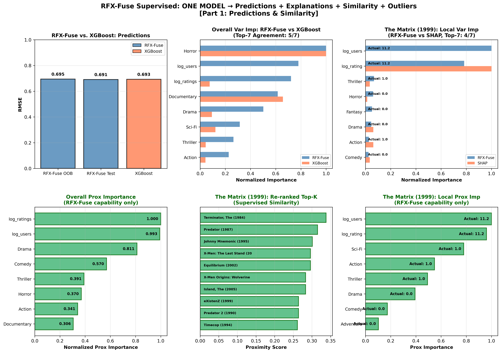
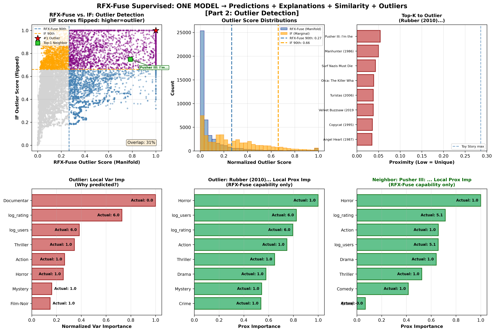
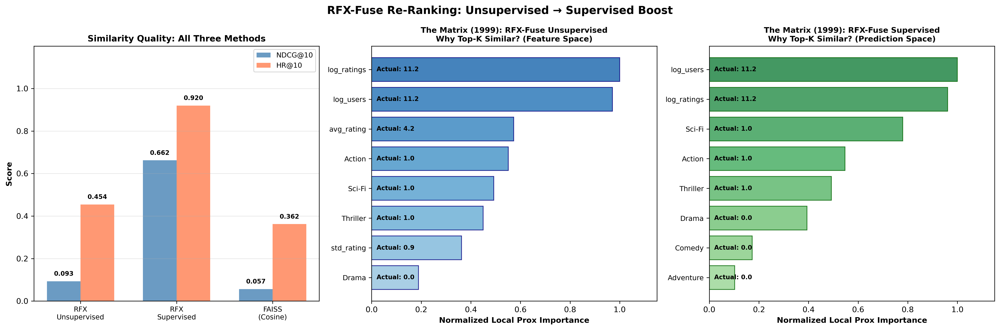
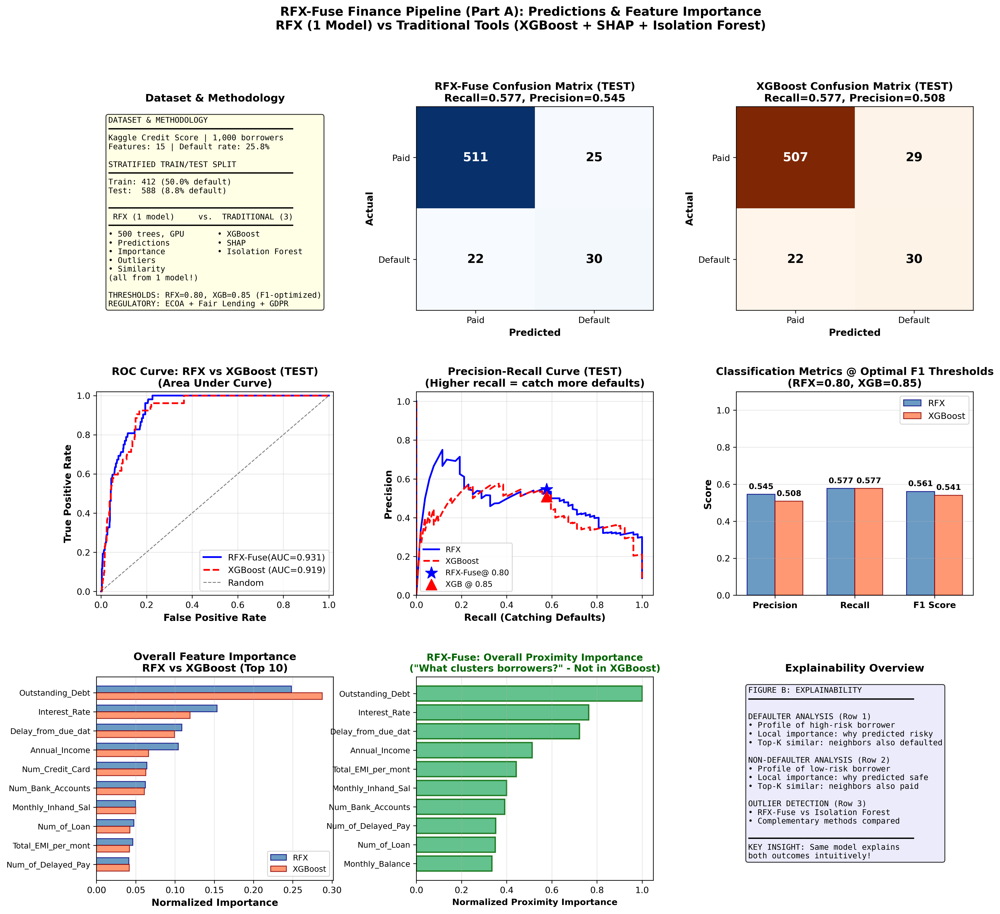
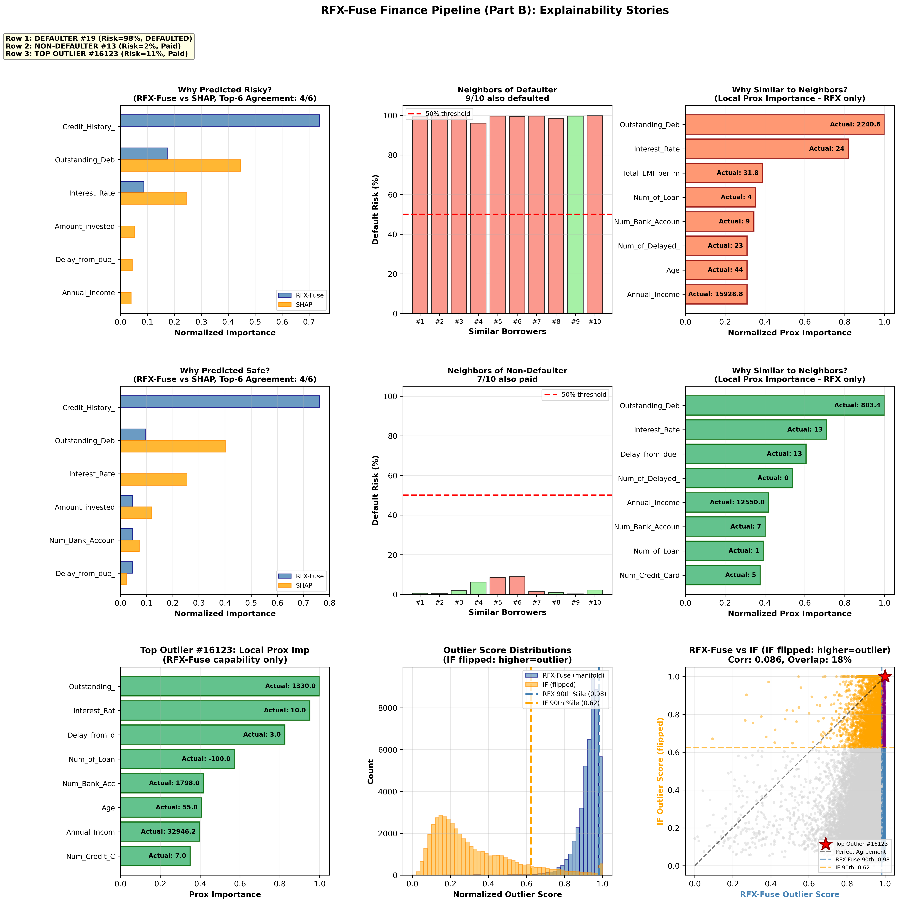
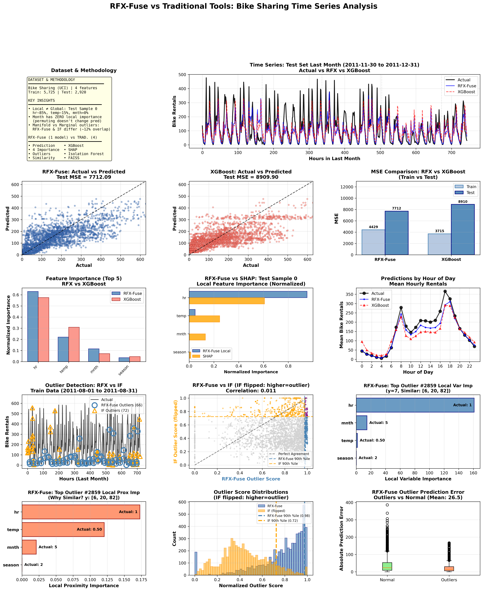
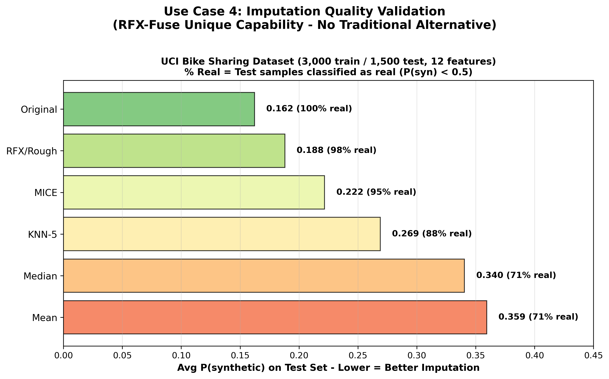
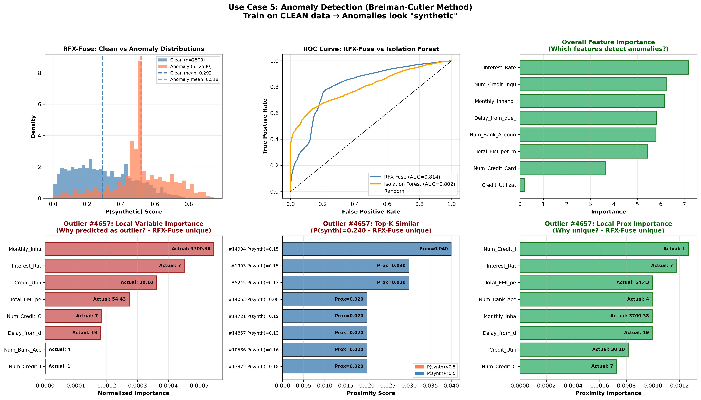

# RFX-Fuse: Breiman and Cutler's Random Forests as a Forest Unified Learning and Similarity Engine - Extended with Native Explainable Similarity 

[](https://opensource.org/licenses/MIT)
[](https://pypi.org/project/rfx-fuse/)
[](https://www.python.org/downloads/)
[](https://en.cppreference.com/w/cpp/17)
[](https://developer.nvidia.com/cuda-toolkit)
[](https://doi.org/10.5281/zenodo.18397354)


**RFX-Fuse** (Random Forests X [X=compression] — Forest Unified Learning and Similarity Engine) delivers Breiman and Cutler's complete vision for Random Forests as a Forests Unified Machine Learning and Similarity Engine with native GPU/CPU support.

Breiman and Cutler designed Random Forests as more than an ensemble predictor. Their original implementation from the early 2000s included classification, regression, unsupervised learning, proximity-based similarity, outlier detection, missing value imputation, and visualization. Modern libraries like scikit-learn's random forests implementation (2010-2011) skipped many of these features. 

These capabilities enable it to be a unified learning and similarity engine. With just 1-2 model objects, we can achieve comparable accuracy and output to 3-5 main industery tools. For example, 1 model has comparable output to 4 separate tools for Time Series Regression + native explainable similarity. 1 model = 1 set of trees grown once. 

## Key Use Cases

| Use Case | RFX-Fuse | Comparable Approach |
|----------|----------|---------------------|
| Recommender Systems | 1–2 models | 5 tools (FAISS + XGBoost + Shap + Isolation Forests + Custom Code) |
| Finance Explainability | 1 model | 3 tools (XGBoost + Shap + Isolation Forests) |
| Time Series Regression | 1 model | 4 tools (XGBoost + Shap + Isolation Forests + FAISS) |
| Imputation Validation | 1 model | time series methods (general tabular: RFX-Fuse) |
| Anomaly Detection | 1 model | 3 tools (Isolation Forests + Shap + Custom Code) |

## Novel Contributions

1. **Native Explainable Similarity**: Breiman and Cutler's original similarity scoring via proximities enable comparable output with Faiss for NDCG + HR on retrieval. Proximity Importance gives the why.



*Explanations available in [Zenodo paper](https://doi.org/10.5281/zenodo.18397354).*

2. **Imputation Quality Validation for General Tabular Data** — Rank imputation methods by how "real" the imputed data looks, without ground truth labels.

## Comparable Tools Functionality Comparison

| Feature | RFX-Fuse | XGBoost | sklearn RF | FAISS |
|---------|----------|---------|------------|-------|
| Classification | ✓ | ✓ | ✓ | — |
| Regression | ✓ | ✓ | ✓ | — |
| Unsupervised | ✓ | — | — | — |
| Overall importance | ✓ | ✓ | ✓ | — |
| Local importance (per-sample) | ✓ | SHAP | — | — |
| Proximity/similarity scoring | ✓ | — | — | ✓ |
| Overall proximity importance | ✓ | — | — | — |
| Local proximity importance | ✓ | — | — | — |
| Top-K similar with explanations | ✓ | — | — | — |
| Outlier detection with explanations | ✓ | — | — | — |
| Missing value imputation | ✓ | — | — | — |

## Installation

### From PyPI

```bash
pip install rfx-fuse
```

*CPU-only version (`pip install rfx-fuse-cpu`) coming soon.*

### From Source (GPU)

```bash
git clone https://github.com/chriskuchar/RFX-Fuse.git
cd RFX-Fuse
pip install -e .
```

### From Source (CPU-only)

```bash
git clone https://github.com/chriskuchar/RFX-Fuse.git
cd RFX-Fuse
pip install -e . --config-settings=cmake.args=-DRFX_CPU_ONLY=ON
```

### Prerequisites

- **CMake** 3.12+
- **Python** 3.8+
- **C++ compiler** with C++17 support (GCC 7+, Clang 5+)
- **OpenMP** (usually included with compiler)
- **CUDA toolkit** 12.8+ (for GPU acceleration)

### Verify Installation

```python
import RFXFuse as rfx
print(f"RFX-Fuse version: {rfx.__version__}")
print(f"CUDA enabled: {rfx.__cuda_enabled__}")
```

## Examples

Each use case has a complete demonstration script in the `examples/` folder:

| Use Case | Demo Script | Description |
|----------|-------------|-------------|
| **Recommender Systems** | [`examples/recommender_system/demo_recommender_system.py`](examples/recommender_system/demo_recommender_system.py) | MovieLens 25M: similarity retrieval + ranking with explanations |
| **Finance Explainability** | [`examples/classification/demo_loan_classification.py`](examples/classification/demo_loan_classification.py) | Loan default prediction with 4-type explainability |
| **Time Series Regression** | [`examples/time_series/demo_time_series.py`](examples/time_series/demo_time_series.py) | Bike sharing: prediction + outlier detection |
| **Imputation Validation** | [`examples/data_imputation/demo_imputation.py`](examples/data_imputation/demo_imputation.py) | Rank imputation methods without ground truth |
| **Anomaly Detection** | [`examples/anomaly_detection/demo_anomaly_detection.py`](examples/anomaly_detection/demo_anomaly_detection.py) | Breiman-Cutler outlier detection |

Run an example:
```bash
cd examples/time_series
python demo_time_series.py
```

## Industry Use Cases

### Use Case 1: Recommender Systems

RFX-Fuse Unsupervised for retrieval + RFX-Fuse Supervised for re-ranking on MovieLens 25M.

#### Recommender System Stage 1:



*Explanations available in [Zenodo paper](https://doi.org/10.5281/zenodo.18397354).*

 <br><br>

#### Recommender System Stage 2 Part 1:



*Explanations available in [Zenodo paper](https://doi.org/10.5281/zenodo.18397354).*
 <br><br>
#### Recommender System Stage 2 Part 2:



*Explanations available in [Zenodo paper](https://doi.org/10.5281/zenodo.18397354).*
 <br><br>
#### Recommender System Stage 2 Part 3:



*Explanations available in [Zenodo paper](https://doi.org/10.5281/zenodo.18397354).*

**[View Code →](examples/recommender_system/demo_recommender_system.py)**

---

### Use Case 2: Finance Explainability

Single classifier provides regulatory-compliant explanations (ECOA, GDPR, Fair Lending).





*Explanations available in [Zenodo paper](https://doi.org/10.5281/zenodo.18397354).*

**[View Code →](examples/classification/demo_loan_classification.py)**

---

### Use Case 3: Time Series Regression

RFX-Fuse Regressor on UCI Bike Sharing dataset with full explainability.



*Explanations available in [Zenodo paper](https://doi.org/10.5281/zenodo.18397354).*

**[View Code →](examples/time_series/demo_time_series.py)**

---

### Use Case 4: Imputation Quality Validation

**Novel capability for general tabular data.** Rank imputation methods by how "real" the imputed data looks.



*Explanations available in [Zenodo paper](https://doi.org/10.5281/zenodo.18397354).*

**[View Code →](examples/data_imputation/demo_imputation.py)**

---

### Use Case 5: Anomaly Detection

Breiman-Cutler method: train on clean data, anomalies have high P(synthetic).



*Explanations available in [Zenodo paper](https://doi.org/10.5281/zenodo.18397354).*

**[View Code →](examples/anomaly_detection/demo_anomaly_detection.py)**

## API Reference

For complete API documentation with all parameters, methods, and examples, see **[docs/API.md](docs/API.md)**.

## Performance

### GPU Benchmarks

**Environment:** NVIDIA RTX 3060 (12GB), AMD Ryzen 7 5800X, 32GB RAM

| Use Case | Train Size | Features | Trees | Training Time |
|----------|------------|----------|-------|---------------|
| Recommender (Unsup) | 59,047 (×2) | 23 | 1,000 | ~1,040s |
| Recommender (Sup) | 47,237 | 21 | 1,000 | 120s |
| Finance Classification | 46,396 | 15 | 500 | 69s |
| Bike Regression | 5,725 | 4 | 1,000 | 24s |
| Imputation Validation | 3,000 | 12 | 100 | 3.6s |
| Anomaly Detection | 15,000 | 8 | 100 | 112s |

*Training times include predictions, similarity scoring, proximity importance, local importance, and all explainability features where applicable.*

### CPU Benchmarks

*Coming soon.*

## Methodology

For detailed methodology, see:
- **Zenodo:** [https://doi.org/10.5281/zenodo.18397354](https://doi.org/10.5281/zenodo.18397354)
- **arXiv:** submission #7171299 (submitted Jan 20, 2026)

## Citation

```bibtex
@software{kuchar2026rfxfuse,
  author       = {Kuchar, Chris},
  title        = {RFX-Fuse: Breiman and Cutler's Unified ML Engine + Native Explainable Similarity},
  year         = {2026},
  publisher    = {Zenodo},
  doi          = {10.5281/zenodo.18397354},
  url          = {https://doi.org/10.5281/zenodo.18397354}
}
```

## Acknowledgments

This work aims to implement the full unified learning and similarity engine Dr. Leo Breiman and Dr. Cutler created when they made their Fortran/Java implementation in the early 2000s.

Special thanks to Dr. Adele Cutler for generously sharing original Breiman-Cutler Random Forest source materials, which made this faithful restoration and extension possible.

## Work in Progress

- Multi-class classification support

## Previous Work

- This is the successor to https://github.com/chriskuchar/RFX. 

## License

MIT License - see [LICENSE](LICENSE) for details.

